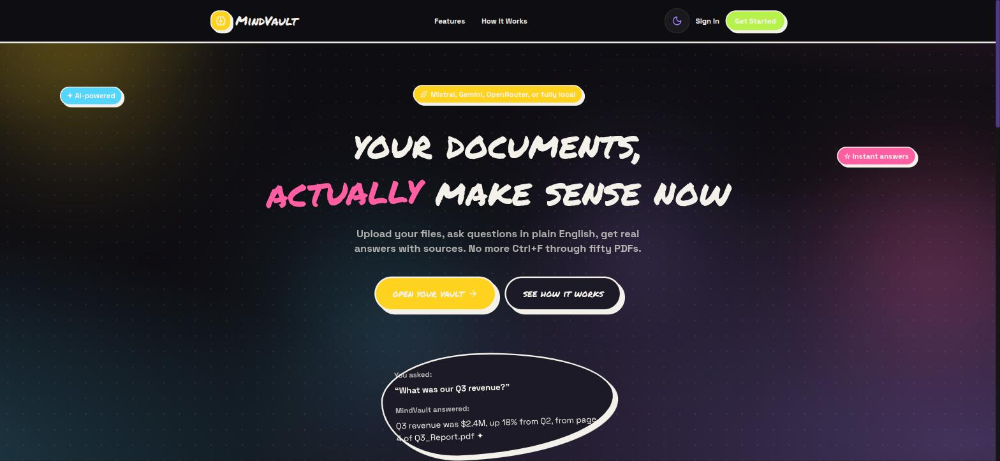
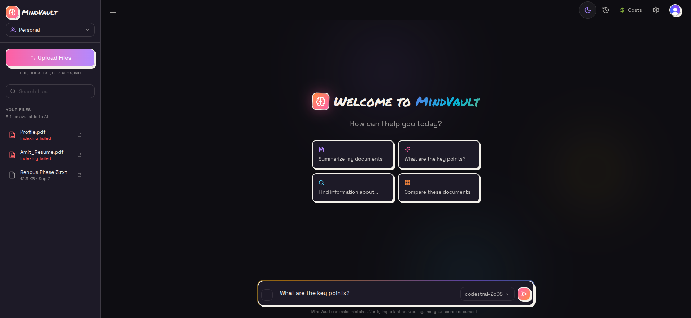
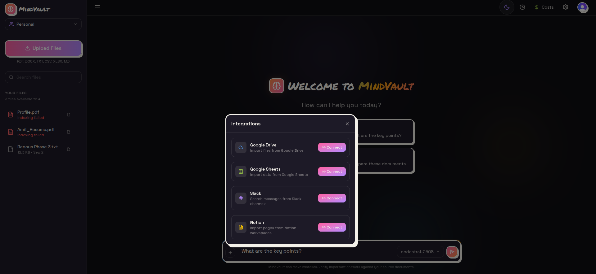
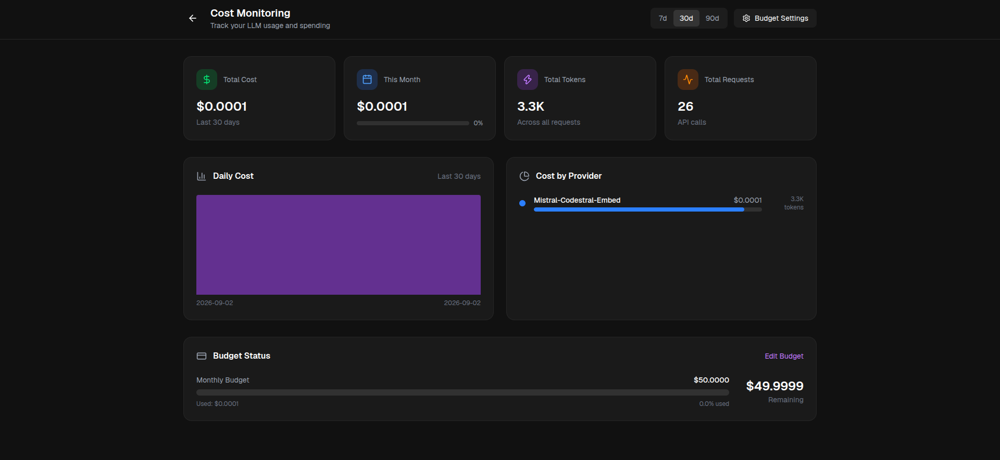
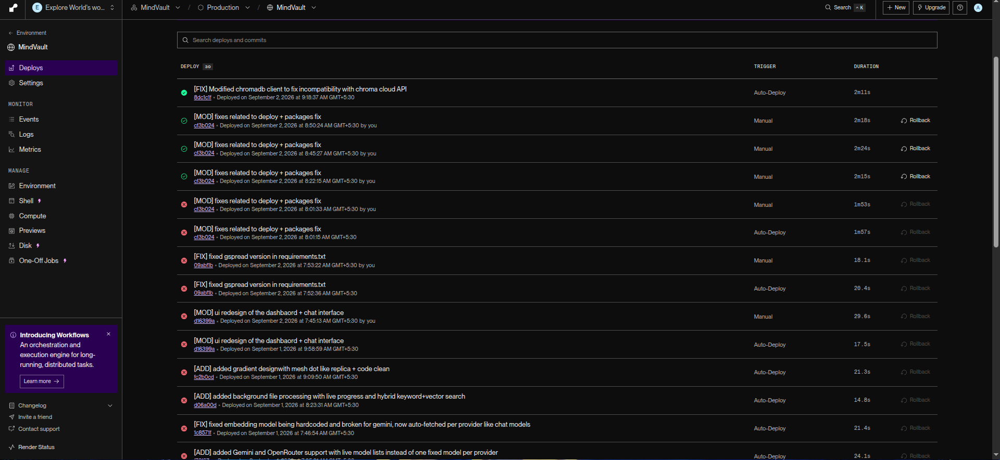

# MindVault

**AI-powered document intelligence.** Upload your files, ask questions in plain English, get real answers with sources — no more `Ctrl+F` through fifty PDFs.

---

## Screenshots

### Landing Page


### Chat Interface


### Integrations


### Cost Monitoring


### Production Deployment (Render)


---

## Problem Statement

Knowledge inside an organization is scattered across PDFs, spreadsheets, Slack threads, and Notion pages. Finding a single fact usually means manually opening files one by one and searching through them, hoping the right document is even the one you picked. This gets worse as the number of files grows — search-by-memory does not scale, and plain keyword search misses answers that are phrased differently from the query.

## How We Solved It

MindVault ingests documents from multiple sources, breaks them into chunks, and embeds them into a vector store alongside a keyword index. When a question is asked, it retrieves the most relevant chunks using hybrid (keyword + vector) search and passes them to an LLM, which answers strictly from that retrieved context and cites the exact source file. This turns a pile of unstructured files into a single, queryable knowledge base.

## What This Platform Is

MindVault is a self-hostable, multi-tenant RAG (Retrieval-Augmented Generation) platform. Users upload documents or connect external sources, and chat with an AI assistant that answers questions using only their own data. It supports multiple LLM providers, tracks cost per request, and scopes every file, chat, and answer strictly to the signed-in user or workspace.

---

## Features

- **Multi-format ingestion** — PDF, DOCX, XLSX, TXT, CSV, and Markdown
- **Hybrid retrieval** — keyword (BM25) + vector search for more accurate answers on exact terms, names, and numbers
- **Source-cited answers** — every answer links back to the exact file and chunk it came from
- **Multiple LLM providers** — Mistral, Gemini, OpenRouter, or a fully local Ollama model, switchable per user
- **External integrations** — Google Drive, Google Sheets, Slack, and Notion, so existing content can be synced in without manual export
- **Workspaces** — shared team knowledge bases with role-based access, separate from personal files
- **Cost monitoring** — per-request token and dollar tracking, budget alerts, and a live cost dashboard
- **Authentication** — Clerk-based sign-in with Google OAuth support
- **Hosted vector storage** — Chroma Cloud, so embeddings persist independently of the app server

---

## Local Setup

### Prerequisites
- Python 3.11+
- Node.js 18+
- A Postgres database (or SQLite for local-only testing)
- API keys for at least one LLM provider (Mistral, Gemini, or OpenRouter), or a local Ollama install

### 1. Backend

```bash
cd backend
python3 -m venv venv
source venv/bin/activate
pip install -r requirements.txt
```

Create `backend/.env`:

```env
DATABASE_URL=sqlite:///./data/mindvault.db
JWT_SECRET=some-long-random-string
CLERK_SECRET_KEY=your_clerk_secret_key

MISTRAL_API_KEY=your_mistral_key
LLM_PROVIDER=mistral

GOOGLE_CLIENT_ID=your_google_client_id
GOOGLE_CLIENT_SECRET=your_google_client_secret
GOOGLE_REDIRECT_URI=http://localhost:8000/api/auth/google/callback

SLACK_CLIENT_ID=your_slack_client_id
SLACK_CLIENT_SECRET=your_slack_client_secret

NOTION_CLIENT_ID=your_notion_client_id
NOTION_CLIENT_SECRET=your_notion_client_secret

# Optional: Chroma Cloud (falls back to a local persistent store if unset)
CHROMA_API_KEY=your_chroma_cloud_api_key
CHROMA_TENANT=your_chroma_tenant_id
CHROMA_DATABASE=your_chroma_database_name
```

Run the API:

```bash
uvicorn app.main:app --reload --port 8000
```

### 2. Frontend

```bash
npm install
```

Create `.env.local` in the repo root:

```env
NEXT_PUBLIC_API_URL=http://localhost:8000
NEXT_PUBLIC_CLERK_PUBLISHABLE_KEY=your_clerk_publishable_key
CLERK_SECRET_KEY=your_clerk_secret_key
NEXT_PUBLIC_CLERK_SIGN_IN_URL=/login
NEXT_PUBLIC_CLERK_SIGN_UP_URL=/signup
NEXT_PUBLIC_CLERK_AFTER_SIGN_IN_URL=/dashboard
NEXT_PUBLIC_CLERK_AFTER_SIGN_UP_URL=/dashboard
```

Run the app:

```bash
npm run dev
```

The frontend runs at `http://localhost:3000` and talks to the backend at `http://localhost:8000`.

---
